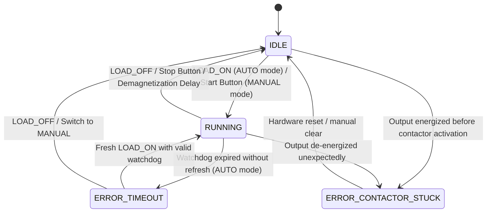

# Smart Farm Pump Controller - System Design & Architecture

## 1. Executive Summary & Overview

The **Smart Farm Pump Controller** is a mission-critical IoT actuator node based on the **Seeed Studio XIAO ESP32-C3**. It manages dual-source power switching (**Solar Photovoltaic Inverter** vs. **Utility Grid**) for high-power water pumping in an automated agricultural environment.

The system features robust hardware and software safety interlocking, bidirectional **ESP-NOW** communication with the Smart Farm Hub, autonomous safety watchdog timers, local manual overrides, and real-time visual diagnostic indicators.

```
                  +----------------------------------------------+
                  |               Smart Farm Hub                 |
                  +----------------------------------------------+
                                         |
                                         | ESP-NOW (2.4 GHz)
                                         v
+----------------------------------------------------------------------------------+
|                          Smart Farm Pump Controller                              |
|                                                                                  |
|   +-------------------+       +--------------------+       +-----------------+   |
|   | Local HMI Inputs  |       |   PumpController   |       | Visual Feedback |   |
|   |  - AUTO / MANUAL  | ----> |  (FreeRTOS Task)   | ----> |  - Grid LED     |   |
|   |  - SOLAR / GRID   |       |                    |       |  - Solar LED    |   |
|   |  - START / STOP   |       +---------+----------+       +-----------------+   |
|   +-------------------+                 |                                        |
|                                         v                                        |
|                              +----------------------+                            |
|                              |  PumpStateMachine    |                            |
|                              |  (Safety Watchdog)   |                            |
|                              +----------+-----------+                            |
|                                         |                                        |
|                                         v                                        |
|                              +----------------------+                            |
|                              | ContactorController  |                            |
|                              | (Break-before-make)  |                            |
|                              +----------+-----------+                            |
+-----------------------------------------|----------------------------------------+
                                          |
                     +--------------------+--------------------+
                     |                                         |
                     v                                         v
        +--------------------------+              +--------------------------+
        |   Grid AC Contactor      |              |   Solar AC Contactor     |
        | (Utility 220V AC Source) |              | (Inverter 220V AC Source)|
        +-------------+------------+              +------------+-------------+
                      |                                        |
                      +-------------------+--------------------+
                                          |
                                          v
                               +---------------------+
                               |   Water Pump Motor  |
                               +---------------------+
```

---

## 2. Hardware Architecture & Electrical Safety

### 2.1. Dual-Source Power Delivery
- **Paralleled 5V Power Rails:** Two 5V AC/DC converters (one powered by Grid 220V AC, the other by Solar Inverter 220V AC) have their DC outputs paralleled through Schottky diodes to power the XIAO ESP32-C3 and driver circuitry.
- **Battery Autonomy:** Optional 1S Li-Po / 18650 cell allows continuous ESP-NOW reception and telemetry reporting during complete AC outages.

### 2.2. Contactor Actuation & Interlocking
To prevent catastrophic short-circuits between unsynchronized AC sources (Grid and Solar Inverter):
1. **Mechanical / Electrical Interlock:** Auxiliary NC (normally closed) contacts physically prevent both contactor coils from energizing simultaneously.
2. **Software Break-Before-Make:** `ContactorController` enforces an asynchronous **demagnetization delay (150 ms default)** whenever switching between sources or turning off a contactor.
3. **Driver Compatibility:** Configurable `active_level` (Active-High for optically isolated MOC3043M TRIAC drivers, or Active-Low for standard relay modules) with automatic pull-up/pull-down configuration on boot.

---

## 3. Hardware Pinout (Seeed Studio XIAO ESP32-C3)

| Pin | GPIO | Identifier | Direction | Description | Active Level |
| :--- | :--- | :--- | :--- | :--- | :--- |
| **D0** | `GPIO 2` | `PIN_BUTTON_ACTION` | Input | Manual Start/Stop Toggle Pushbutton | Low (Pull-Up, Press = Toggle) |
| **D1** | `GPIO 3` | `PIN_SWITCH_MODE` | Input | Mode Selector (`AUTO` / `MANUAL`) | Low (Pull-Up, Closed = AUTO) |
| **D2** | `GPIO 4` | `PIN_SWITCH_SOURCE` | Input | Manual Source Selector (`SOLAR` / `GRID`) | Low (Pull-Up, Closed = SOLAR) |
| **D3** | `GPIO 5` | `PIN_CONTACTOR_GRID` | Output | Grid Contactor Gate Trigger | High (MOC) / Low (Relay) |
| **D4** | `GPIO 6` | `PIN_CONTACTOR_SOLAR`| Output | Solar Contactor Gate Trigger | High (MOC) / Low (Relay) |
| **D5** | `GPIO 7` | *(Reserved)* | - | Auxiliary Sensor / Expansion | - |
| **D6** | `GPIO 21`| `PIN_LED_GRID` | Output | Grid Status LED (Green) | High (Active-High) |
| **D7** | `GPIO 20`| `PIN_LED_SOLAR` | Output | Solar Status LED (Yellow) | High (Active-High) |
| **D8** | `GPIO 8` | `PIN_WS2812_DATA` | Output | WS2812 Tank Level Indicator Data (Phase 2) | High (RMT) |
| **D9** | `GPIO 9` | `PIN_BUTTON_BOOT_OTA`| Input | Onboard BOOT Button / Emergency OTA Trigger | Low (Pull-Up, Press = OTA) |
| **D10**| `GPIO 10`| `PIN_OUTPUT_MONITOR` | Input | Output Voltage AC Monitor (Phase 2) | Low/High |

---

## 4. Software Architecture & Design Principles

The firmware adheres to clean architecture principles tailored for high-reliability embedded systems:

- **Single Responsibility Principle (SRP):** Each class encapsulates a single functional domain (State Machine, Contactors, LEDs, Protocol Parsing, Telemetry).
- **Hardware Abstraction Layer (HAL):** Business logic has zero direct dependencies on ESP-IDF or FreeRTOS headers. Hardware primitives are injected through abstract interfaces (`IGpioHAL`, `ITimerHAL`, `IHalFreertos`, `ISystemHAL`).
- **Dependency Injection (DI):** All components receive their dependencies via constructors, enabling 100% host-based unit testing on Linux.
- **Clean `app_main`:** `app_main` performs synchronous component instantiation and lifecycle startup before exiting. No endless loops or polling in the main task.
- **Dedicated FreeRTOS Task:** `PumpController::run_task` runs deterministically at 50 ms periods (`vTaskDelay(pdMS_TO_TICKS(50))`, Stack 4096 bytes, Priority 5).

---

## 5. Component Breakdown

```
main/
├── include/
│   ├── interfaces/
│   │   ├── i_contactor_controller.hpp   # Contactor hardware abstraction
│   │   ├── i_output_monitor.hpp         # Output AC voltage feedback
│   │   ├── i_pump_controller.hpp        # Top-level coordinator interface
│   │   ├── i_pump_led_controller.hpp    # Dual-LED visual coordinator
│   │   ├── i_pump_state_machine.hpp     # Pump FSM and watchdog interface
│   │   ├── i_pump_status_reporter.hpp   # Telemetry sender interface
│   │   └── i_tank_level_display.hpp     # Tank level indicator interface
│   ├── contactor_controller.hpp         # Break-before-make contactor driver
│   ├── null_output_monitor.hpp          # Phase 1 stub for output monitor
│   ├── null_tank_level_display.hpp      # Phase 1 stub for WS2812 display
│   ├── pump_command_handler.hpp         # ESP-NOW inbound command router
│   ├── pump_controller.hpp              # Main orchestrator
│   ├── pump_led_controller.hpp          # Coordinated Grid/Solar LED animator
│   ├── pump_state_machine.hpp           # State machine with safety watchdog
│   ├── pump_status_reporter.hpp         # Telemetry broadcaster
│   └── pump_types.hpp                   # Domain enums and data structures
└── src/
    ├── contactor_controller.cpp
    ├── pump_command_handler.cpp
    ├── pump_controller.cpp
    ├── pump_led_controller.cpp
    ├── pump_state_machine.cpp
    └── pump_status_reporter.cpp
```

---

## 6. Finite State Machine (`PumpStateMachine`)

### 6.1. States & Transitions


### 6.2. Autonomous Safety Watchdog
- In **AUTO** mode, `LOAD_ON` specifies a `watchdog_timeout_s` (e.g., 300 seconds).
- `PumpStateMachine::tick(50ms)` decrements the timer.
- If the Hub goes offline or radio packets are lost, the node automatically cuts power to the pump when the watchdog reaches 0, preventing tank overflow or dry-run damage.

---

## 7. Communication Protocol & Telemetry

### 7.1. Outbound Telemetry (`LOAD_CONTROL_STATUS = 0x04`)
Broadcasted via ESP-NOW to `farm::NodeId::HUB`:
- **Periodic Heartbeat:** Every 5 seconds.
- **Event-Driven Instant Trigger:** Dispatched on the exact 50ms tick of any state transition (`IDLE` $\leftrightarrow$ `RUNNING`, mode switch, manual buttons, errors).

```cpp
struct LoadControlStatus
{
    uint8_t circuit_id;                  // Circuit ID (0 for primary pump)
    PowerProfile power_profile;          // ALWAYS_ON (0x00)
    ControlMode control_mode;            // AUTO (1) or MANUAL (2)
    PowerSource active_power_source;     // UNKNOWN (0), SOLAR (1), GRID (2)
    LoadState load_state;                // IDLE (0), RUNNING (1), ERROR_*
    uint32_t runtime_s;                  // Continuous runtime in current activation
    uint32_t uptime_s;                   // Total node uptime in seconds
};
```

### 7.2. Inbound Commands & ACK Routing
`PumpCommandHandler` drains inbound messages from `rx_queue` and issues immediate ACKs:
- `LOAD_ON` (`0x41`): Activates specified source with watchdog; returns `AckStatus::OK` or `ERROR_PROCESSING` (if in MANUAL mode).
- `LOAD_OFF` (`0x42`): Deactivates contactors; returns `AckStatus::OK`.
- `SYNC_TIME` (`0x43`): Synchronizes system clock via `TimeManager`.
- `TANK_LEVEL_UPDATE` (`0x05`): Updates local water level display.
- `START_OTA` (`0x01`): Initiates firmware upgrade session.
- `REBOOT` (`0x02`): Gracefully de-energizes contactors and restarts ESP32.

---

## 8. HMI & Visual Feedback (LED Controllers)

| System State | Active Source | Grid LED (Green) | Solar LED (Yellow) |
| :--- | :--- | :--- | :--- |
| **IDLE (Ready)** | Any | Short Beacon (every 2.5s) | Off |
| **RUNNING** | **GRID** | **Solid ON** | Off |
| **RUNNING** | **SOLAR** | Off | **Solid ON** |
| **ERROR_TIMEOUT** | Any | Slow Blink (1 Hz) | Slow Blink (1 Hz) |
| **ERROR_CONTACTOR_STUCK** | Any | Rapid Strobe (5 Hz) | Rapid Strobe (5 Hz) |
| **MANUAL Mode** | Selected Source | Dual Flash Pattern | Dual Flash Pattern |

---

## 9. Testing & CI/CD Strategy

### 9.1. Host-Based Unit Testing (Linux)
Testing is treated as a first-class citizen. 100% of business logic is compiled and verified natively on Linux using GoogleTest and GoogleMock:

| Test Project | Test Count | Description |
| :--- | :--- | :--- |
| `test_pump_state_machine` | 14 tests | State transitions, watchdog expiry, auto/manual rules |
| `test_pump_command_handler` | 11 tests | ESP-NOW command decoding, validation, ACK replies |
| `test_pump_status_reporter` | 6 tests | Heartbeat timing, state change triggers, payloads |
| `test_contactor_controller` | 8 tests | Demagnetization delay, active-high/low, interlocking |
| `test_pump_led_controller` | 10 tests | Dual-LED coordination across all system states |
| `test_pump_controller` | 6 tests | Orchestration loop, button/switch polling, reboot |
| **Total** | **55 tests** | **100% Passing (82.8% Line Coverage, 95.2% Function Coverage)** |

### 9.2. Automated GitHub Actions CI
- **`build.yml`:** Builds production target firmware on ESP32-C3 container.
- **`host_test.yml`:** Executes full test suite (`build_all_tests`, `coverage_clean`, `ctest`) and publishes unified HTML coverage reports to GitHub Pages.
