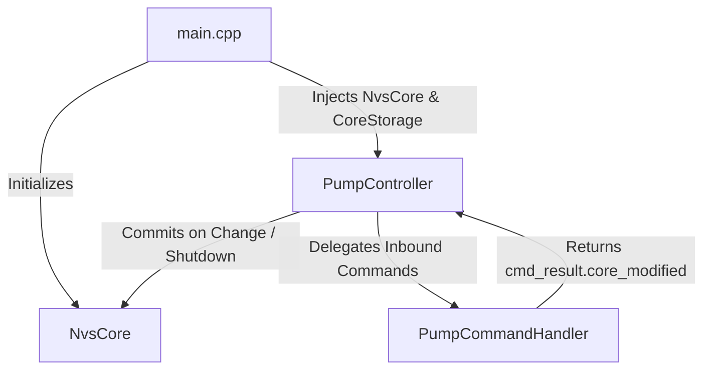

# NVS Persistence and Pump Statistics Architecture

## 1. Overview and Objectives

This document specifies the persistence architecture for the **Smart Farm Pump Controller Node**, aligning its storage lifecycle with the design patterns established in `smart-farm-solar-sensor` and `smart-farm-common`.

The persistence layer is split into two distinct tiers:
1. **`NvsCore` (System Lifecycle & Identity):** Standard cross-node core storage handling node identity, firmware metadata, boot/crash telemetry, time synchronization state, and power profiles.
2. **`PumpNvs` / `PumpStats` (Domain-Specific Statistics):** Dedicated non-volatile storage tracking mechanical wear, hourmeter metrics across power sources (Solar vs Grid), commutation cycles, and fault event telemetry.

---

## 2. System Core Persistence (`NvsCore` Alignment)

### 2.1. Role in `PumpController`
In the current implementation, `NvsCore` is initialized in `main.cpp` and passed directly to `PumpCommandHandler`. Moving forward, `NvsCore&` and `CoreStorage&` will be injected into `PumpController` as the top-level orchestrator.



### 2.2. Core Responsibilities & Triggers

| Event / Trigger | Responsible Component | Action on `NvsCore` / `CoreStorage` |
| :--- | :--- | :--- |
| **Node Boot / Reset** | `main.cpp` / `PumpController` | `nvs_core.init(g_core_storage, default_core, reset_reason, wakeup_cause, is_cold_boot)` |
| **`SYNC_TIME` Command** | `PumpCommandHandler` $\rightarrow$ `PumpController` | `core.has_valid_time = true`, `core.last_sync_unix_time_ms = now_ms`. `PumpController` calls `nvs_core.save(core_storage)` when `core_modified == true`. |
| **Graceful Reboot (`REBOOT`)** | `PumpController` | Updates clean shutdown state before calling `hal_system.restart()`. |
| **Night Sleep Mode (Future)** | `PumpController` | Commits core state before entering Deep Sleep when the tank is full during nocturnal periods. |

---

## 3. Domain-Specific Storage (`PumpStats`)

### 3.1. Rationale for Dedicated Pump Statistics
Unlike generic IoT nodes, motor-driven pumps and high-power AC contactors are mechanical systems subject to wear. The following domain metrics are essential for farm operations:
- **Maintenance Hourmeter (Preventive Maintenance):** Water well pumps and mechanical seals require periodic maintenance (e.g., every 500–1000 operating hours).
- **Solar vs. Grid Energy Accounting:** Tracking the total hours pumped under free solar power versus utility grid power quantifies ROI and electrical consumption.
- **Contactor Wear (Commutation Cycles):** Relays and contactors have rated electrical lifespans (e.g., $10^5$ operations under inductive load). Tracking total start cycles prevents unexpected contactor failure.
- **Fault Diagnostics:** Persisting accumulated watchdog timeouts and contactor anomalies enables diagnosing intermittent field failures.

---

### 3.2. `PumpStats` Data Structure

The storage structure follows the flat binary design with CRC-32 integrity validation:

```cpp
#pragma once

#include <cstdint>
#include <stdbool.h>

namespace farm {

/**
 * @brief Domain statistics storage for Pump Controller.
 * Flat struct with CRC-32 validation for RTC memory and NVS flash persistence.
 */
struct PumpStats
{
    // Magic & Schema
    static constexpr uint32_t PUMP_STATS_MAGIC = 0x50554D50; // "PUMP" in ASCII
    static constexpr uint8_t PUMP_STATS_VERSION = 1;

    uint32_t magic{PUMP_STATS_MAGIC};
    uint8_t version{PUMP_STATS_VERSION};

    // Hourmeter (Lifetime Accumulated Operation)
    uint32_t total_runtime_s{0};        ///< Total seconds pump has operated across all sources
    uint32_t solar_runtime_s{0};        ///< Total seconds operated on Solar power
    uint32_t grid_runtime_s{0};         ///< Total seconds operated on Grid power

    // Lifecycle & Wear Metrics
    uint32_t start_cycles_total{0};     ///< Total number of pump start commutations
    uint32_t manual_starts_total{0};    ///< Number of starts initiated via manual physical button
    uint32_t auto_starts_total{0};      ///< Number of starts initiated remotely by Hub

    // Fault & Anomaly Counters
    uint32_t watchdog_timeouts_total{0};///< Total occurrences of safety watchdog timeouts
    uint32_t contactor_faults_total{0}; ///< Contactor stuck / pre-energized anomalies detected

    // Checksum (MUST BE THE LAST FIELD)
    uint32_t crc{0};

    void reset()
    {
        *this = {};
        magic = PUMP_STATS_MAGIC;
        version = PUMP_STATS_VERSION;
    }

    bool operator==(const PumpStats& other) const
    {
        return magic == other.magic &&
               version == other.version &&
               total_runtime_s == other.total_runtime_s &&
               solar_runtime_s == other.solar_runtime_s &&
               grid_runtime_s == other.grid_runtime_s &&
               start_cycles_total == other.start_cycles_total &&
               manual_starts_total == other.manual_starts_total &&
               auto_starts_total == other.auto_starts_total &&
               watchdog_timeouts_total == other.watchdog_timeouts_total &&
               contactor_faults_total == other.contactor_faults_total;
    }

    bool operator!=(const PumpStats& other) const { return !(*this == other); }
};

} // namespace farm
```

---

## 4. Proposed `PumpNvs` Component Architecture

Following the `SolarSensorNvs` design:

```cpp
class PumpNvs
{
public:
    PumpNvs(IPersistenceBackend& rtc_backend, IPersistenceBackend& nvs_backend);

    esp_err_t init(PumpStats& target, const PumpStats& defaults, bool& is_cold_boot);
    esp_err_t save(const PumpStats& source);
    esp_err_t commit(const PumpStats& source);

private:
    IPersistenceBackend& rtc_backend_;
    IPersistenceBackend& nvs_backend_;
    uint32_t calculate_crc(const PumpStats& data) const;
};
```

### 4.1. Dual-Tier Storage Strategy
1. **RTC Fast Cache (`RTC_DATA_ATTR`):**
   - High-frequency in-memory updates (e.g., updating runtime seconds during active pumping, start counters on every contactor transition).
   - Zero flash wear.
2. **Flash Persistence (`NVS` partition):**
   - Periodic commits (e.g., every 15 minutes of continuous operation or upon stopping the pump `RUNNING` $\rightarrow$ `IDLE`).
   - Guarantees data durability across power outages.

---

## 5. Integration Roadmap

When implementing this feature in a future iteration:
1. Create `PumpStats` struct in `include/pump_stats_types.hpp`.
2. Implement `PumpNvs` in `include/pump_nvs.hpp` and `src/pump_nvs.cpp`.
3. Add unit tests in `host_test/test_pump_nvs/`.
4. Inject `NvsCore&` and `PumpNvs&` into `PumpController`.
5. Connect `PumpStateMachine` state change hooks to increment `start_cycles_total`, update `solar_runtime_s` / `grid_runtime_s`, and trigger periodic NVS syncs.
